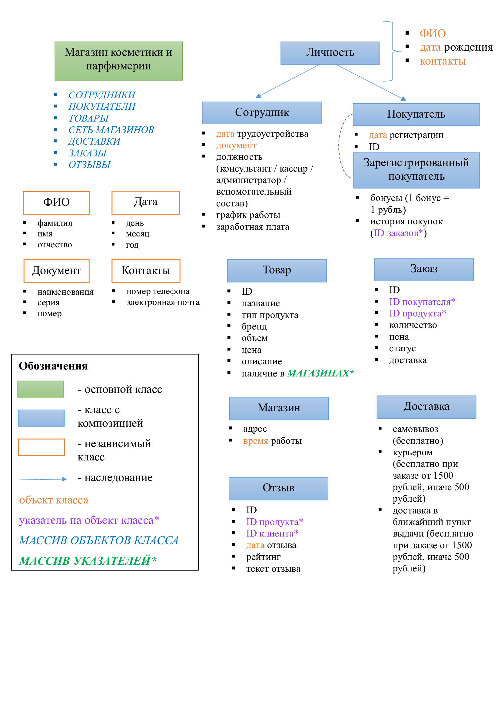

# Проект с индивидуальной предметной областью

**Выбранная предметная область:** МАГАЗИН КОСМЕТИКИ И ПАРФЮМЕРИИ.

**Цель работы:** реализовать программное обеспечение для управления покупателями, сотрудниками, товарами и процессами в магазине косметики и парфюмерии.

## Задачи проекта:
1.	Реализовать программное обеспечение для учета сотрудников, покупателей, товаров, сети магазинов, доставок, заказов и отзывов.
2.	Приложение должно обеспечивать возможность администратору быстро и легко выполнять свои функции:
*	Собирать данные о покупателях и их заказах.
*	Управлять инвентарем товаров (добавление, редактирование, удаление товаров).
*	Актуализировать информацию о наличии товаров в различных магазинах.
*	Организовывать доставку товаров и отслеживать статус доставки.
*	Собирать отзывы покупателей о товарах и услугах.
3.	Обеспечить возможность генерации отчетов по продажам, клиентам и товарам.

## Функциональные требования:
1.	Основной режим работы приложения упрощает работу администратора, предоставляет все необходимые ему функции, однако ограничивает доступ к информации о сотрудниках и покупателях.
2.	Доступ к особому режиму создания/изменения сотрудников, назначения им окладов, мониторингу их работы будет осуществляться по особому логину/паролю, которые будут выданы директору.
3.	Все данные будут храниться в CSV-формате и подтягиваться при очередном запуске приложения.
4.	При запуске приложения на основе текущей даты удаляется неактуальная информация (устаревшие отзывы, отмененные заказы).
5.	Возможность поиска и фильтрации товаров по различным критериям (бренд, цена, категория).
6.	Обеспечить возможность покупателям оставлять отзывы о товарах и услугах магазина, а также возможность их редактирования и удаления.
7.	Оповещения о недостаточном количестве запасов товаров. 

### Схема классов

###Исследование работы контейнера std::vector [Текст ссылки](source/STL_vector.pdf)